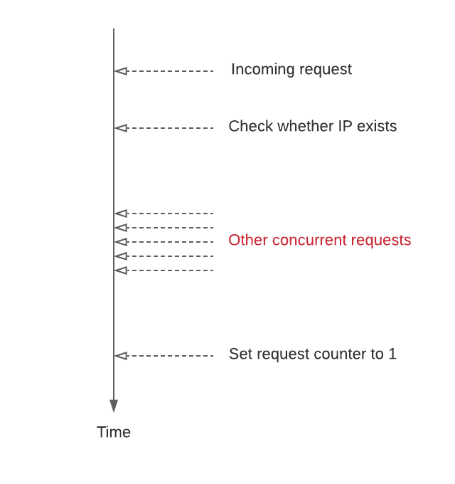

# Dcard Homework - Rate Limiter Middleware

## Description
Dcard 每天午夜都有大量使用者湧入抽卡，為了不讓伺服器過載，請設計一個 middleware：

- 限制每小時來自同一個 IP 的請求數量不得超過 1000
- 在 response headers 中加入剩餘的請求數量 (X-RateLimit-Remaining) 以及 rate limit 歸零的時間 (X-RateLimit-Reset)
- 如果超過限制的話就回傳 429 (Too Many Requests)
- 可以使用各種資料庫達成
## Idea
因申請條件需要我們熟悉 Golang 或是 Node.js，而我本身又是 Golang 的愛好者，因此這次作業直接選擇 Golang 作為開發語言。

此應用場景很適合使用 Redis 這類 in-memory 的 key-value store。實作上我以 client IP 當作 key 並記錄個別 IP 的請求總數，並我們可以利用 Redis 的 TTL 機制維護 rate limit 的歸零時間。另外，我使用了 gin 這個 web framework 構建 API 與 middleware、運用工廠模式與 wire 實現依賴注入、撰寫了單元測試並串接到 CI 工具 (使用 TravisCI)。

與 Redis 的互動我使用了 interface 以解耦對資料庫的依賴。這樣的優點除了便於撰寫 mock test，在將來若要換別種資料庫也相對容易，只要實作此介面即可。
## Race Condition
最一開始的 rate limiter 實作中，會先檢查 IP 是否存在，若存在則 counter 加 1，否則就以此 IP 新增一個 key 並設其值為 1：
```go
exist, err = m.Repo.Exists(ip)
if err != nil {
    m.logger.Error(err)
    c.Abort()
    return
}

var newVisitCount int64
if !exist {
    if err := m.Repo.SetVisitCount(ip, 1); err != nil {
        m.logger.Error(err)
        c.Abort()
        return
    }
    newVisitCount = 1
} else {
    var err error
    newVisitCount, err = m.Repo.IncrVisitCountByIP(ip)
    if err != nil {
        m.logger.Error(err)
        c.Abort()
        return
    }
}
```
然而這樣的寫法在併發量很高的時候會出現 race condition：



在我們判斷 key 是否存在與將它設為 1 的之間，可能會有其他併發的請求打進來而沒有被記錄到，這會造成 counter 的值會小於實際的請求數量。

為了解決這個問題，我使用了 Redis 的 `SETNX`，當 key 不存在時 set value，當 key 存在時則忽略，並設下 key 的 TTL。值得注意的是此指令為原子操作，因而解決了上述的 race condition。
## API Gateway
若對每個進來的請求我們都訪問 Redis，那當大流量瞬間湧進時 Redis server 很可能也會無法應付。這時有一些解決方式可以考慮：
1. 先訪問 local cache，如果 local cache 沒有才去訪問 Redis
2. 在 API 前方擋一個 API Gateway (reverse proxy)，並在 Gateway 上使用 in-memory rate limiter 直接阻擋超出的流量，不讓它訪問到後端 API。

這裡選擇第二種方式。方法一因還需考慮各個 API replica 的 cache 一致性與 expiration 的而複雜化了問題，而方法二有個好處就是許多 reverse proxy 都有現成且 well-tested 的 middleware 可以利用，讓我們不用再造輪子。我們使用的 reverse proxy 是 [Traefik](https://traefik.io)，並加入 [RateLimit Middleware](https://doc.traefik.io/traefik/middlewares/ratelimit/)，設定每小時自同 IP 的請求數量不得超過 1000，並且預留 50 個 bursting 請求。現在我們有兩層的 rate limiter 保護後端 API，若我們部署到 K8s 上還可以使用 HPA (Horizontal Pod Autoscaler) 根據流量改變 replica 數量，提高並發量。
## Redis Configuration
如果我們的記憶體最大容量只有 5G，但是卻寫了 10G 的資料怎麼辦？這時就需要 Redis 的淘汰機制去刪除不需要的資料。Redis 採用的淘汰機制是定期刪除 + 懶惰刪除。

當一個 key 過期時，Redis 其實不會馬上刪除它。Redis 預設每 100 ms「隨機」抽樣 key 出來檢查，若這個 key 過期才刪除它。然而若只有隨機抽樣刪除可能造成許多過期的 key 沒有被刪除，進而佔用記憶體空間。因此 Redis 還使用了懶惰刪除，當我們在獲取某個 key 時，Redis 會先去檢查它是否過期，如果過期就會將其刪除。但即使使用了定期刪除 + 懶惰刪除還是不夠，若定期刪除沒刪除到 key，我們也沒有去訪問那個 key，這樣就會讓記憶體佔用率越來越高。因此，Redis 還設計了一個很重要的參數：`maxmemory-policy`。

`maxmemory-policy` 這個參數規範了當 memory 滿的時候 Redis 該如何選擇淘汰的 key。在此應用場景我們可以使用 `volatile-lru`，此設定會淘汰最近最少使用 (Least-Recently-Used, LRU) 並且 TTL 已經 expire 的 key。使用 `volatile-lru` 的好處是我們只會丟棄過期的 key 而不會影響其他仍尚未過期的資料。`volatile-lru` 為 `maxmemory-policy` 的預設值，但我認為仍值得拿出來討論。

順帶一提，若我們只是把 Redis 當作緩存而非像此場景使用 Redis 儲存 volatile data，我們可以使用 `llkeys-lru`，這個參數會從整個 keyset 中丟棄最近最少使用的 key，包含那些尚未過期的資料，讓 Redis 在淘汰 key 時有更大的彈性。
## Usage
啟動服務：
```bash
sh run.sh
```
這個 script 會 export 所有需要的環境變數並啟動容器。

測試 API。我們必須要提供 `Host` header 才能為了讓 Traefik 知道我們的目標 Host：
```bash
curl -v localhost/hello -H "host:dcard.homework"
```

你會看到類似以下的回應：
```
*   Trying 127.0.0.1...
* TCP_NODELAY set
* Connected to localhost (127.0.0.1) port 80 (#0)
> GET /hello HTTP/1.1
> host:dcard.homework
> User-Agent: curl/7.58.0
> Accept: */*
>
< HTTP/1.1 200 OK
< Content-Length: 13
< Content-Type: text/plain; charset=utf-8
< Date: Fri, 19 Feb 2021 18:40:04 GMT
< X-Ratelimit-Remaining: 999
< X-Ratelimit-Reset: 3600
<
* Connection #0 to host localhost left intact
Hello, world!
```

執行測試：
```bash
cd app && go test ./...
```
